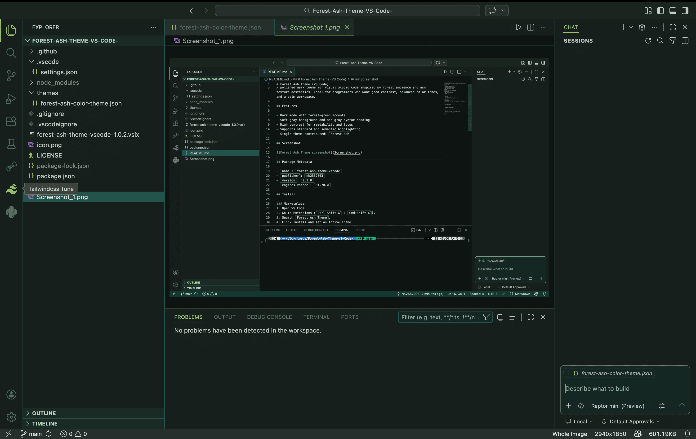
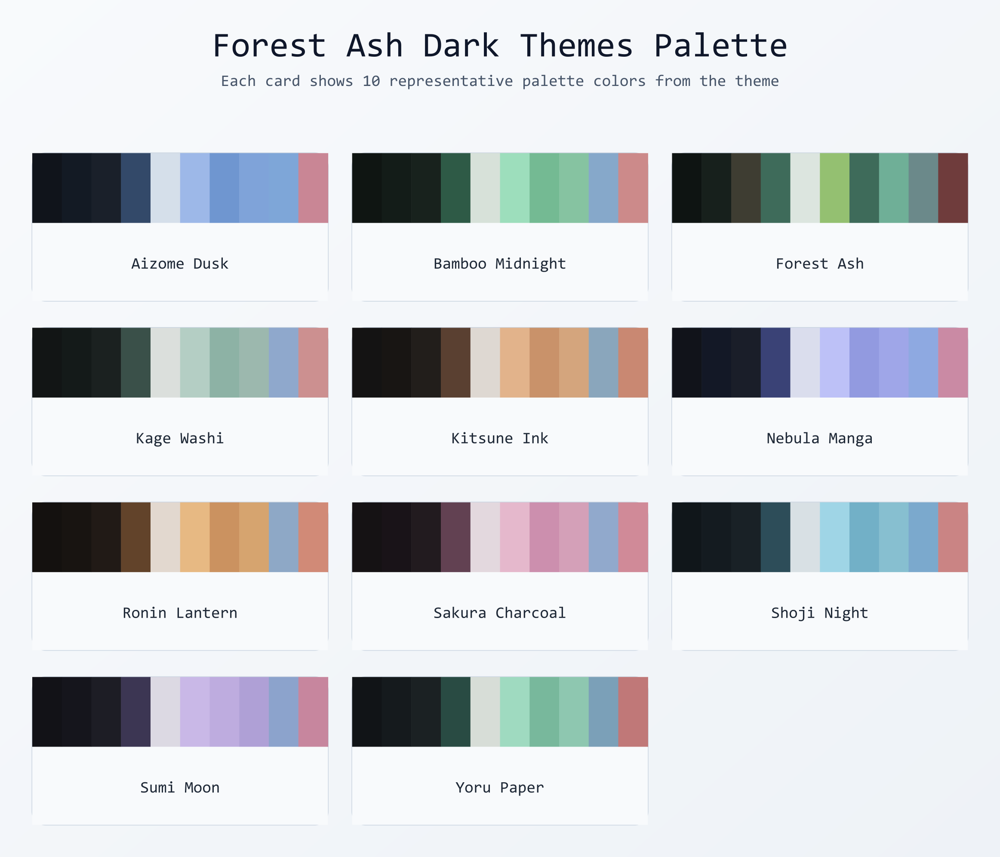
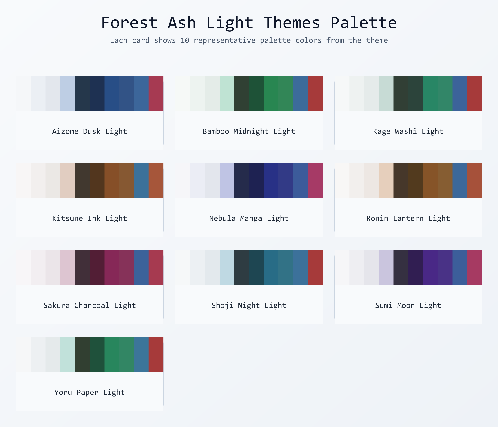

# Forest Ash Theme (VS Code)

A curated set of dark and light, eye-friendly themes for Visual Studio Code, inspired by forest ash textures and anime mood boards. Each palette is designed for readability across long coding sessions.

## Theme Collection

This extension now includes 21 themes:

### Dark Palette Sheet

#### Dark Themes Name
1. Forest Ash
2. Forest Ash Yoru Paper
3. Forest Ash Sumi Moon
4. Forest Ash Kitsune Ink
5. Forest Ash Shoji Night
6. Forest Ash Aizome Dusk
7. Forest Ash Ronin Lantern
8. Forest Ash Bamboo Midnight
9. Forest Ash Nebula Manga
10. Forest Ash Sakura Charcoal
11. Forest Ash Kage Washi

### Light Palette Sheet

#### Light Themes Name

12. Forest Ash Yoru Paper Light
13. Forest Ash Sumi Moon Light
14. Forest Ash Kitsune Ink Light
15. Forest Ash Shoji Night Light
16. Forest Ash Aizome Dusk Light
17. Forest Ash Ronin Lantern Light
18. Forest Ash Bamboo Midnight Light
19. Forest Ash Nebula Manga Light
20. Forest Ash Sakura Charcoal Light
21. Forest Ash Kage Washi Light

## Theme Generator

Forest Ash now includes a built-in **custom theme generator** that lets you create your own unique variants from any accent color.

### How to Access the Generator

| Method | Instructions |
|--------|-------------|
| **Command Palette** (Recommended) | Press `Ctrl+Shift+P` / `Cmd+Shift+P`, type `Forest Ash: Generate Custom Theme`, and press `Enter`. |
| **Right-Click (Explorer)** | Right-click any file or folder in the Explorer sidebar, then select **Generate Custom Theme**. |
| **Right-Click (Editor)** | Right-click inside any editor tab, then select **Generate Custom Theme**. |
| **VS Code Settings** | Go to `Preferences > Settings`, search for **Forest Ash**, and configure the default accent color. |

### Available Commands

- **Forest Ash: Generate Custom Theme** — Create a new theme from a hex color, dark/light variant, and custom name.
- **Forest Ash: Apply Custom Theme** — Quickly switch between your generated custom themes.
- **Forest Ash: Delete Custom Theme** — Remove a generated theme permanently.
- **Forest Ash: List Custom Themes** — View all saved custom themes in a webview panel with color swatches.

## Design Goals

- Dark and low-glare backgrounds for reduced eye fatigue
- Calm, desaturated accents with anime-inspired mood
- Distinct identity per theme without harsh neon contrast
- Balanced syntax tokens for comments, strings, keywords, and functions
- Clean terminal ANSI colors that match each palette

## Package Metadata

- `name`: `forest-ash-theme`
- `displayName`: `Forest Ash Theme`
- `publisher`: `NK2552003`
- `version`: `1.2.7`
- `engines.vscode`: `^1.70.0`

## Install

### Marketplace
1. Open VS Code.
2. Go to Extensions (`Ctrl+Shift+X` / `Cmd+Shift+X`).
3. Search for `Forest Ash Theme`.
4. Install and switch via `Preferences: Color Theme`.

### Local Source
1. Clone this repository.
2. Run `npm install`.
3. Run `npm run package` (requires `vsce`).
4. Install the generated `.vsix` in VS Code (`Extensions` > `...` > `Install from VSIX`).

## Development

- Build package: `npm run package`
- Publish package: `npm run publish`
- Prepublish guard: `npm run prepublishOnly`

## Repository Structure

- `package.json` - extension manifest and scripts
- `themes/` - all contributed color theme JSON files
- `README.md` - documentation and theme catalog

## License

MIT
